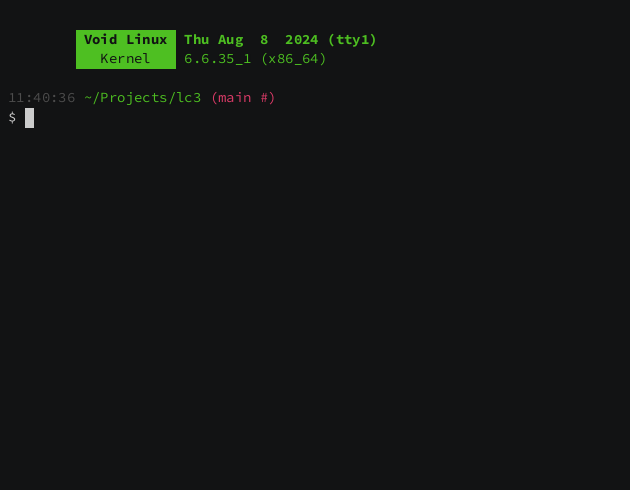

# lc3-vm

Virtual machine for the [LC-3](https://en.wikipedia.org/wiki/Little_Computer_3) (Little Computer 3) architecture. [Specification](./spec/lc3-isa.pdf).

| Rogue  | 2048  |
|:-------|:------|
|  |  |

# Usage

Load one or more image files to memory, and execute indefinitely starting at address `0x3000`.

```sh
$ lc3-vm ./image-file1.obj ./image-file2.obj ...
```

# Building

Building from source requires the [Rust](https://www.rust-lang.org/) compiler and the [Cargo](https://doc.rust-lang.org/cargo/) package manager, both can be installed with [rustup](https://rustup.rs/).

Download source code, build binary, and install to `$HOME/.cargo/bin`:

```sh
$ cargo install --git https://github.com/faresbakhit/lc3-vm
```

Download source code to a new directory and build in *release mode* at `./lc3-vm/target/release/lc3-vm`.

```sh
$ git clone https://github.com/faresbakhit/lc3-vm
$ cd agg
$ cargo build --release
```

# License

lc3-vm, a virtual machine for the LC-3 (Little Computer 3) architecture.
Copyright (C) 2024  Fares A. Bakhit

This program is free software: you can redistribute it and/or modify
it under the terms of the GNU General Public License as published by
the Free Software Foundation, either version 3 of the License, or
(at your option) any later version.

This program is distributed in the hope that it will be useful,
but WITHOUT ANY WARRANTY; without even the implied warranty of
MERCHANTABILITY or FITNESS FOR A PARTICULAR PURPOSE.  See the
GNU General Public License for more details.

You should have received a copy of the GNU General Public License
along with this program.  If not, see <https://www.gnu.org/licenses/>.
